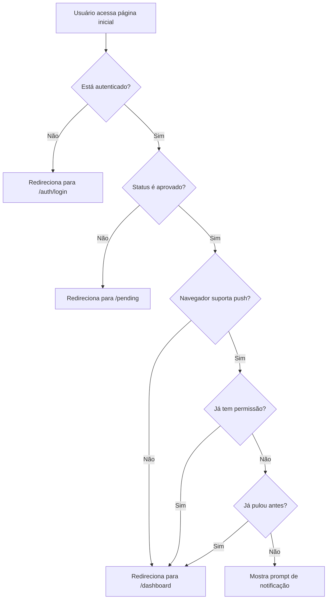

# 🔔 Sistema de Onboarding de Notificações Push

Este documento explica o novo sistema de onboarding de notificações implementado na página inicial do EXL Trading Hub.

## 📋 Visão Geral

A funcionalidade foi implementada para solicitar permissão de notificações push logo na primeira interação do usuário com o sistema, aumentando significativamente as taxas de ativação e melhorando a experiência do usuário.

## 🎯 Objetivos

- ✅ Aumentar a taxa de ativação de notificações push
- ✅ Melhorar o engajamento dos usuários
- ✅ Garantir que usuários não percam alertas importantes
- ✅ Criar uma experiência de onboarding amigável

## 🏗️ Como Funciona

### 1. Fluxo de Decisão



### 2. Estados do Prompt

1. **Loading**: Carregamento inicial enquanto verifica status
2. **Prompt**: Interface amigável explicando benefícios
3. **Processando**: Estado de loading durante ativação
4. **Redirecionamento**: Transição suave para dashboard

## 🎨 Componentes

### NotificationWelcomePrompt

**Localização**: `components/pwa/notification-welcome-prompt.tsx`

**Características**:

- Design moderno com gradientes e ícones
- Explicação clara dos benefícios
- Botões de ação bem definidos
- Feedback visual durante processamento
- Notificação de boas-vindas automática

**Props**:

```typescript
interface NotificationWelcomePromptProps {
  userId?: string; // ID do usuário para subscription
  onPermissionGranted: () => void; // Callback quando permissão é concedida
  onSkip: () => void; // Callback quando usuário pula
}
```

### Página Inicial Atualizada

**Localização**: `app/page.tsx`

**Lógica Principal**:

- Verificação de autenticação e status
- Detecção de suporte a push notifications
- Gerenciamento de estado do prompt
- Persistência de preferência do usuário

## 💾 Persistência de Dados

### LocalStorage

A aplicação utiliza localStorage para lembrar das preferências do usuário:

```typescript
// Chave para armazenar se usuário pulou notificações
"exl-trading-notifications-skipped" = "true" | null;
```

**Comportamento**:

- ✅ Salva quando usuário clica "Pular por enquanto"
- ✅ Remove quando usuário ativa notificações posteriormente
- ✅ Respeita a escolha durante a sessão do navegador

## 🎯 Benefícios Apresentados ao Usuário

### 1. Alertas em Tempo Real

- Notificações instantâneas sobre movimentos do mercado
- Ícone: ⚡ (Zap) em azul

### 2. Funciona Offline

- Recebe alertas mesmo com app fechado
- Ícone: 📱 (Smartphone) em verde

### 3. Segurança e Privacidade

- Dados seguros e controle total
- Ícone: 🛡️ (Shield) em roxo

## 🔧 Integração e Uso

### Ativação Automática

O sistema está integrado automaticamente na página inicial. Não requer configuração adicional.

### Personalização

Para modificar os benefícios apresentados, edite o array de features em `NotificationWelcomePrompt`:

```tsx
const features = [
  {
    icon: Zap,
    color: "blue",
    title: "Seu título",
    description: "Sua descrição",
  },
];
```

### Notificação de Boas-vindas

Quando o usuário ativa as notificações, automaticamente recebe uma notificação de boas-vindas:

```typescript
{
  title: "🎉 EXL Trading Hub",
  body: "Notificações ativadas com sucesso! Agora você receberá alertas importantes em tempo real.",
  icon: "/icons/icon-192x192.png",
  tag: "welcome-notification"
}
```

## 📊 Métricas e Analytics

### Eventos Rastreáveis

1. **Prompt Exibido**: Usuário viu o prompt de notificação
2. **Permissão Concedida**: Usuário ativou notificações
3. **Pulado**: Usuário optou por pular
4. **Erro**: Falha na ativação

### Implementação de Tracking (Opcional)

```typescript
// Adicionar em NotificationWelcomePrompt
const trackEvent = (event: string, data?: any) => {
  // Implementar sua solução de analytics
  console.log("Track:", event, data);
};

// Usar nos callbacks
trackEvent("notification_prompt_shown");
trackEvent("notification_permission_granted");
trackEvent("notification_skipped");
```

## 🚀 Melhorias Futuras

### Possíveis Implementações

1. **A/B Testing**: Testar diferentes designs e textos
2. **Smart Timing**: Mostrar prompt em momentos específicos
3. **Personalização**: Diferentes prompts por tipo de usuário
4. **Analytics**: Métricas detalhadas de conversão
5. **Retry Logic**: Re-exibir prompt após período específico

### Configurações Avançadas

```typescript
// Configurações que podem ser implementadas
interface NotificationOnboardingConfig {
  showDelay: number; // Delay antes de mostrar prompt
  retryAfterDays: number; // Tentar novamente após X dias
  maxAttempts: number; // Máximo de tentativas
  customMessages: {
    // Mensagens personalizadas
    title: string;
    description: string;
    benefits: string[];
  };
}
```

## 🛠️ Manutenção

### Logs Importantes

O sistema gera logs detalhados no console:

- Estado das permissões
- Sucesso/falha na subscription
- Envio de notificações de teste

### Troubleshooting

**Prompt não aparece**:

1. Verificar se usuário tem status "approved"
2. Verificar suporte do navegador
3. Verificar localStorage para flag de "skipped"

**Notificações não funcionam**:

1. Verificar permissões do navegador
2. Verificar service worker registrado
3. Verificar configuração VAPID

## 🔗 Arquivos Relacionados

- `app/page.tsx` - Página inicial com lógica de onboarding
- `components/pwa/notification-welcome-prompt.tsx` - Componente do prompt
- `hooks/use-push-notifications.tsx` - Hook para gerenciar notificações
- `lib/push-service.ts` - Serviço de push notifications
- `public/sw.js` - Service worker para notificações

---

Esta implementação melhora significativamente a experiência do usuário e aumenta as chances de ativação das notificações push, mantendo o sistema profissional e respeitando as escolhas do usuário.
